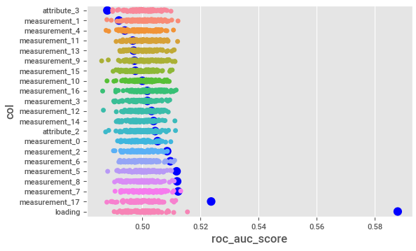

# Tabular Playground Series - August 2022

Kaggle releases monthly competitions in its "playground" series. The competition for August 2022 involved predicting whether a sponge would succeed in soaking up a spill.

While the competition only rewards predictive accuracy, I wanted to produce a model that also that offerred predictive insights to the client, since this is often a real-world objective.

## Background

Description of the competition from the [overview](https://www.kaggle.com/competitions/tabular-playground-series-aug-2022):

> The August 2022 edition of the Tabular Playground Series is an opportunity to help the fictional company Keep It Dry improve its main product Super Soaker. The product is used in factories to absorb spills and leaks.
>
> The company has just completed a large testing study for different product prototypes. Can you use this data to build a model that predicts product failures?

The problem was challenging because there wasn't much data, and there were few good predictors.

## Solution

I was able to place highly with a simple and understandable model thanks to picking up some key insights and applying a simple method in an unconventional way.

Usually Kaggle competitions are won by complex ensembles of boosted trees and/or neural networks, and there were plenty of those submitted in this project. However, most teams realized early on that linear models performed better on this dataset, perhaps because it was generated using a linear model. Additional insights are below.

### Few Meaningful Predictors

While many people default to including all features, limiting the number of inputs helped in this problem. Only three features were definitively useful: `loading`, `measurement_17`, and `attribute_3`.

The figure above shows the AUC of each feature on the target, compared with 100 shuffled copies of each feature. Only the three features above prove themselves significantly better than random copies.

### Imputing `measurement_17`

`measurement_17` could be reliably imputed using a linear combination measurements 4-9, _with weights that change by `product_code`_, as shown in the correlation matrix below. This allows for more accurate predictions than using just mean imputation, for example.

### Using a Backup Model

The relationships between features changed slightly when `loading` is missing. The plot below shows the average failure rate per `product_code` when `loading` is missing vs when it isn't.

Since the test set contains an entirely new set of product codes, I had to identify an attribute that was likely driving this behavior. `attribute_3` was the clear choice. When narrowing down the dataset to only when `loading` was missing, it was clear that `attribute_3` was the only reliable predictor.

The figure above again compares AUC of each feature against 100 shuffled copies, this time when `loading` is missing. This is especially helpful on a small dataset such as this to filter out noise. There may be other relationships, but `attribute_3` was the only feature with a clear relationship.

I chose to use this information to create an entirely new model for when `loading` is unknown, and average it with predictions from the base model (imputing median for loading).

## Model

Overview of the final model:

1. Basic linear model using 2 features (automatically selected based on correlation, which defaulted to `loading` and `measurement_17`)
2. A "backup" linear model used when `loading` is missing with 1 feature (automatically selected based on correlation, which defaulted to `attribute_3`)
      1. Backup and overall model (with imputed median `loading`) averaged together when `loading` is missing, to protect against overfitting.
3. measurements 3-9 used to impute `measurement_17` by `product_code`

I used Ridge regression instead of Logistic Regression as the final linear model, because:

1. For this problem, it produces almost identical results
2. The coefficients are more straightforward to interpret.

### Final Takeaways for the Business

Using a linear regressor for a classification problem is underrated--it often performs just as well as logistic regression from a ranking perspective, and the coefficients have more meaning.

Final Takeaways:

1. 10-unit increase in `loading` roughly leads to a 1.3% increase in `failure` likelihood
2. 100-unit increase in `measurement_17` roughly leads to a 1% increase in `failure` likelihood
3. 1-unit increase in `attribute_3` _when `loading` is missing_ roughly leads to a 5.5% decrease in `failure` likelihood
4. Measurements 3-9 almost perfectly predict `measurement_17`

## Conclusion

My goal for this analysis was to produce a final model that had both predictive accuracy and ease of explanation for the client. If the imaginary sponge manufacturer were asking for my takeaways from this analysis, I would offer the following, in decreasing order of importance:

1. It's very hard to predict whether a sponge will fail! Only the `loading` amount has substantial value, and even that is limited (10-unit increase = 1.3% increase in fail likelihood).
2. `measurement_17` is the only product measurement or attribute that has clear predictive value all the time (100-unit increase = 1% increase in fail rate). It seems to represent some linear combination of measurements 3-9 based on the product.
3. There's a strange pattern in whether `loading` was measured or not--when it's missing, `attribute_3` seems to have a large influence on the failure rate (1-unit increase = 5.5% decrease in fail rate). I would be curious to know what's driving whether loading is measured, and what `attribute_3` represents.
