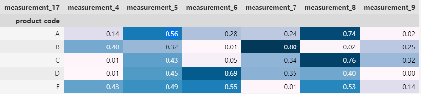

# Tabular Playground Series - August 2022

## Background

Description of the competition from the [overview](https://www.kaggle.com/competitions/tabular-playground-series-aug-2022):

> The August 2022 edition of the Tabular Playground Series is an opportunity to help the fictional company Keep It Dry improve its main product Super Soaker. The product is used in factories to absorb spills and leaks.
>
> The company has just completed a large testing study for different product prototypes. Can you use this data to build a model that predicts product failures?

The problem was challenging because there wasn't much data, and there were few good predictors.

## Solution

I was able to place __ place thanks to picking up some key insights and applying a simple method in an unconventional way.

### Key Insights

Usually Kaggle competitions are won by complex ensembles of boosted trees and/or neural networks, and there were plenty of those submitted in this project. However, most teams realized early on that linear models performed better on this dataset, perhaps because it was generated using a linear model.

My key insights beyond this were:

1. Only 3 variables were reliably useful for prediction: `loading`, `measurement_17`, and `attribute_3`.
      1. Tests with more features tended to perform worse in CV, probably due to noise in the relatively small dataset.
2. `measurement_17` could be reliably imputed using a linear combination measurements 4-9, _with weights that change by `product_code`_, as shown in the correlation matrix below.

### Model

I used a linear model with `loading`, `measurement_17`, and `attribute_3`, using separate linear models of measurements 4-9 by `product_code` to impute `measurement_17` missing values. When `loading` was missing, I used a "backup" model with only `measurement_17` and `attribute_3`.
